# 07 – Entity Relationship Diagram

## Purpose

This document provides a visual representation of the logical data model for Tied Forever.

It shows the principal entities, their important attributes and the relationships between them. It should be read alongside:

- `04-data-model.md`
- `05-entity-specifications.md`
- `06-database-schema.md`

This diagram describes the intended business structure. The final PostgreSQL and Prisma implementation may introduce additional join tables, indexes and implementation-specific fields.

---

## Core Ownership Model

A user may belong to multiple weddings, and a wedding may have multiple users.

Access to a wedding is controlled through the `WEDDING_MEMBER` entity.

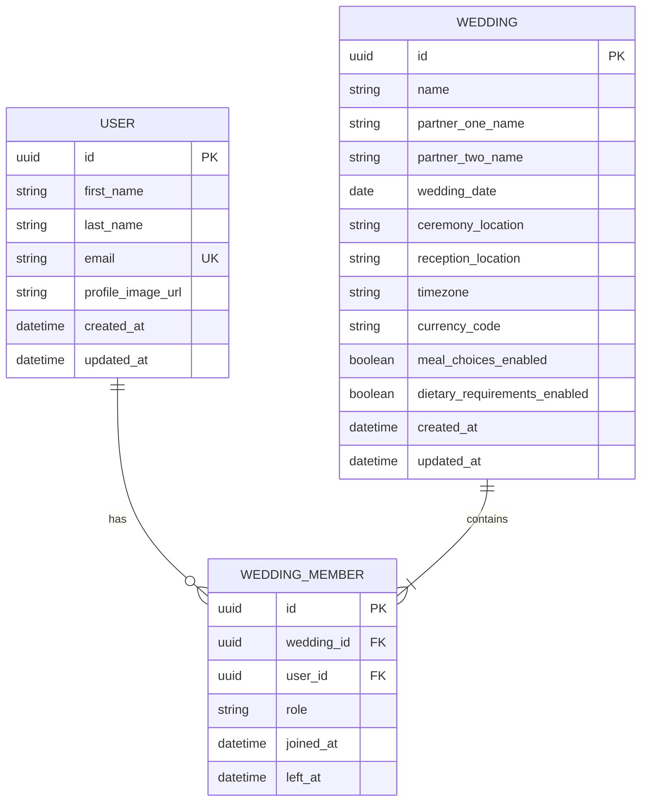

### Membership rules

- A user may belong to more than one wedding.
- A wedding must always have at least one owner.
- A user may only have one active membership per wedding.
- Valid roles are:
  - `OWNER`
  - `EDITOR`
  - `VIEWER`
- A user’s historical activity remains after they leave a wedding.
- The final owner cannot leave until ownership has been transferred.

---

## Planning and Checklist

Each wedding may define its own task categories.

Every task belongs to one category and may optionally be assigned to one wedding member. Tasks may also contain subtasks.

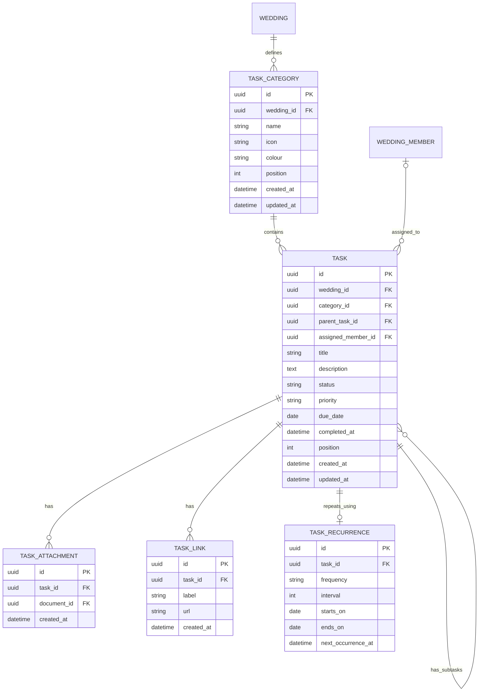

### Task rules

- Every task belongs to exactly one category.
- A task may have no assignee or one assignee.
- The assignee must be an active member of the same wedding.
- Tasks may have nested subtasks.
- Task statuses are:
  - `NOT_STARTED`
  - `IN_PROGRESS`
  - `WAITING`
  - `COMPLETED`
  - `CANCELLED`
- Task priorities are:
  - `LOW`
  - `MEDIUM`
  - `HIGH`
  - `URGENT`
- Completing a task records `completed_at`.
- Deleting a category containing tasks requires the user to:
  - move its tasks to another category,
  - explicitly delete the category and its tasks,
  - or cancel the operation.

---

## Guests, Households and Invitations

Guests may exist independently or belong to a household.

A household may share one address and normally receives one invitation. Individual invitations remain possible where needed.

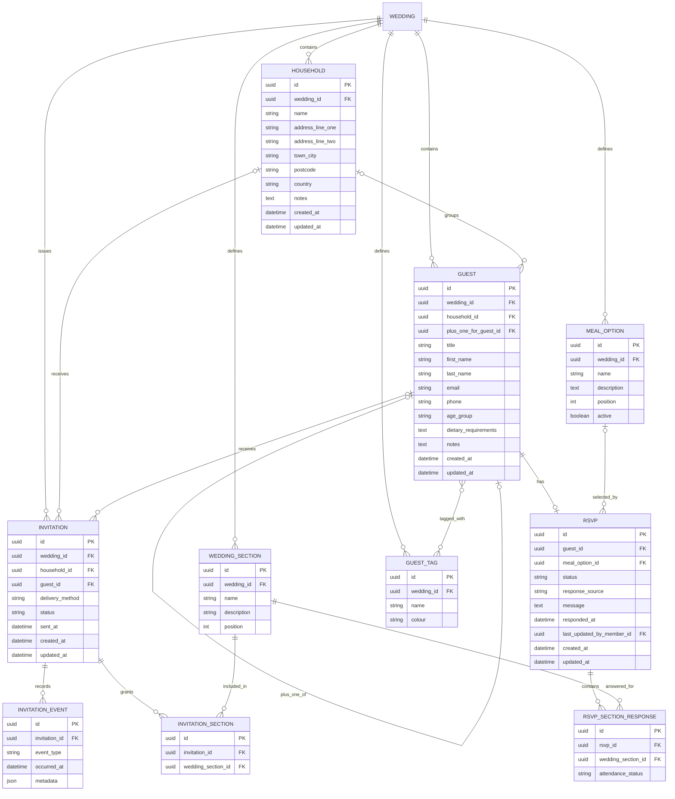

### Guest and invitation rules

- Household membership is optional.
- A household may contain one or more guests.
- Guests in a household normally share one postal address.
- Invitations may be addressed to:
  - one household, or
  - one individual guest.
- An invitation must reference either a household or a guest, but not both.
- A plus-one is represented as a real guest.
- Guest age groups are:
  - `ADULT`
  - `CHILD`
  - `INFANT`
- Wedding sections are configurable and may include:
  - Ceremony
  - Drinks reception
  - Wedding breakfast
  - Evening reception
- Invitations grant access to one or more wedding sections.
- Each guest can respond separately for each section they were invited to.
- RSVP statuses are:
  - `NOT_INVITED`
  - `INVITED`
  - `ACCEPTED`
  - `DECLINED`
  - `NO_RESPONSE`
- RSVP responses may be entered:
  - by the guest,
  - manually by a wedding member,
  - or eventually through an integration.
- Manual changes must be recorded in the activity log.
- Meal selection is optional and controlled through wedding settings.

---

## Custom RSVP Questions

Each wedding may create custom questions for its RSVP form.

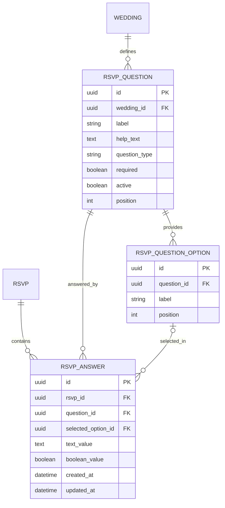

Supported question types may include:

- Short text
- Long text
- Yes or no
- Single choice
- Multiple choice

Examples include:

- Do you require accommodation?
- Do you require transport?
- Would you like a children’s meal?
- Do you need a high chair?
- What song would you like to hear?

---

## Suppliers

Supplier categories are defined by each wedding rather than hard-coded by the application.

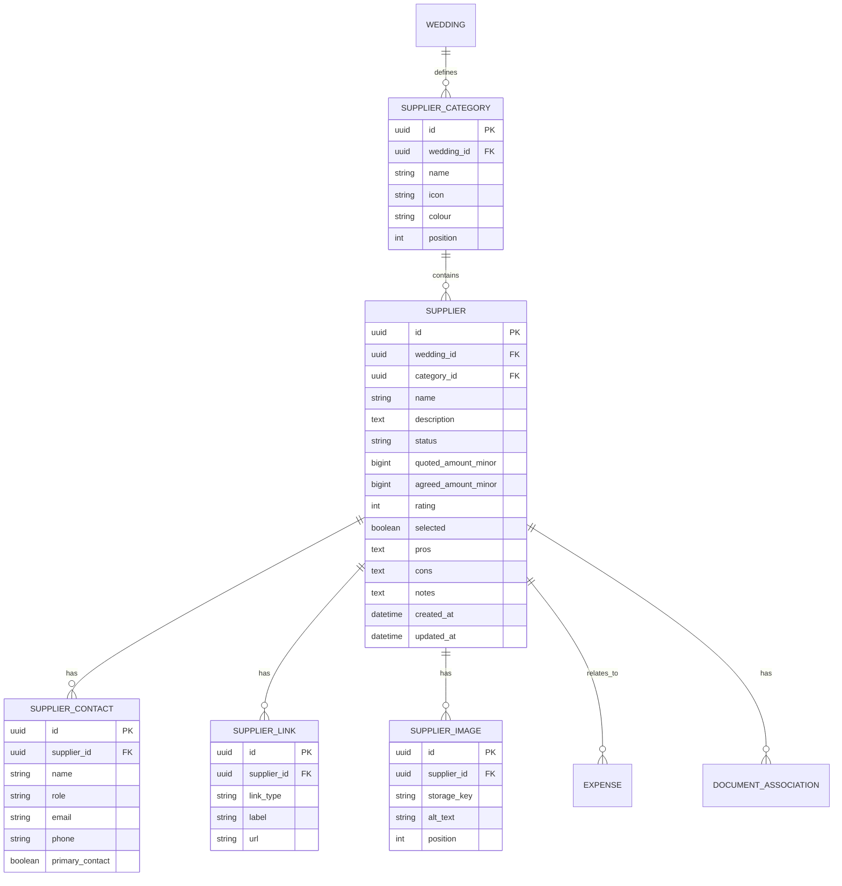

Suggested supplier statuses:

- `RESEARCHING`
- `CONTACTED`
- `AWAITING_RESPONSE`
- `SHORTLISTED`
- `CONFIRMED`
- `REJECTED`
- `CANCELLED`

The venue may use the supplier model while storing additional venue-specific details separately.

---

## Venue

The selected venue may reference an existing supplier and contain venue-specific operational information.

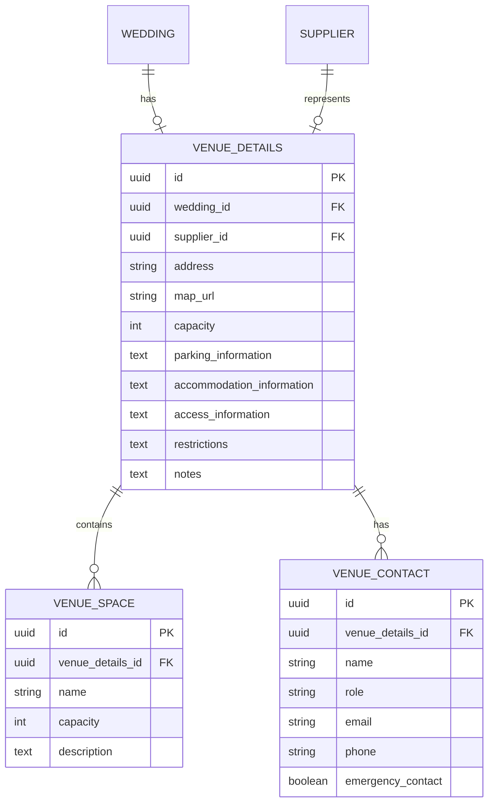

---

## Budget, Expenses and Payments

Budget totals are derived from category allocations, expenses and payments.

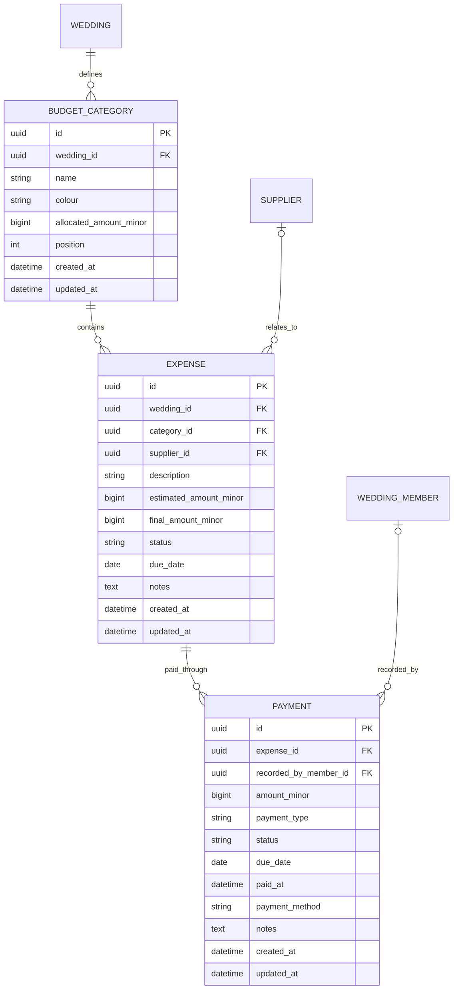

### Budget rules

- Monetary values are stored in the smallest currency unit, such as pence.
- Floating-point values must not be used for money.
- An expense belongs to one budget category.
- An expense may optionally relate to a supplier.
- Payments belong to an expense.
- Deposits and final balances are represented as payment records.
- Total spent, remaining budget and outstanding balances are calculated rather than stored.

---

## Timeline

Timeline groups and events are configurable per wedding.

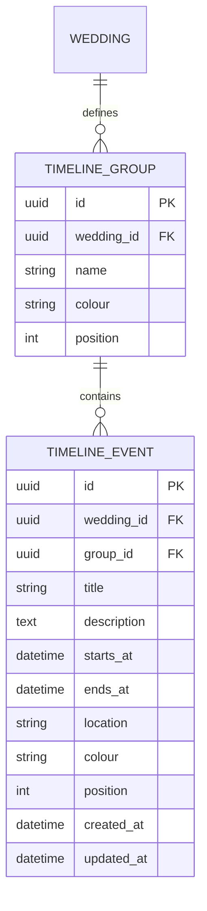

Timeline duration should normally be calculated from `starts_at` and `ends_at`.

---

## Seating Plan

Each wedding may create multiple tables and assign guests to them.

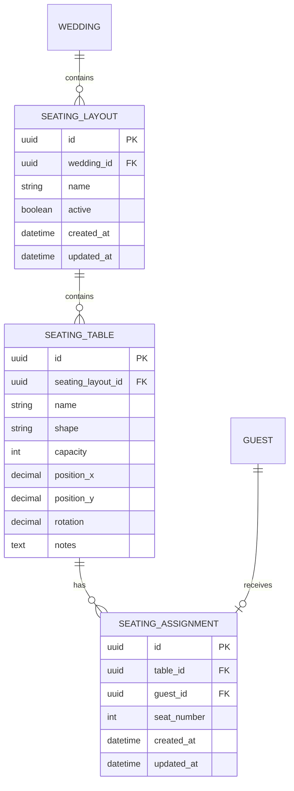

### Seating rules

- A guest may have at most one seating assignment within a seating layout.
- A table must not exceed its capacity.
- Seat numbers are optional in the first version.
- Deleting a table must first remove or reassign its guests.

---

## Gift Registry

Registry items link guests to external retailers. Tied Forever does not process purchases directly.

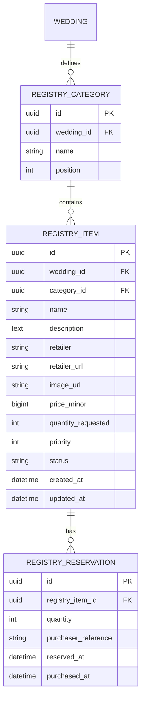

The registry redirects users to the retailer. Payment information is never handled by Tied Forever.

---

## Documents and Attachments

Files are stored in external object storage. PostgreSQL stores metadata and relationships.

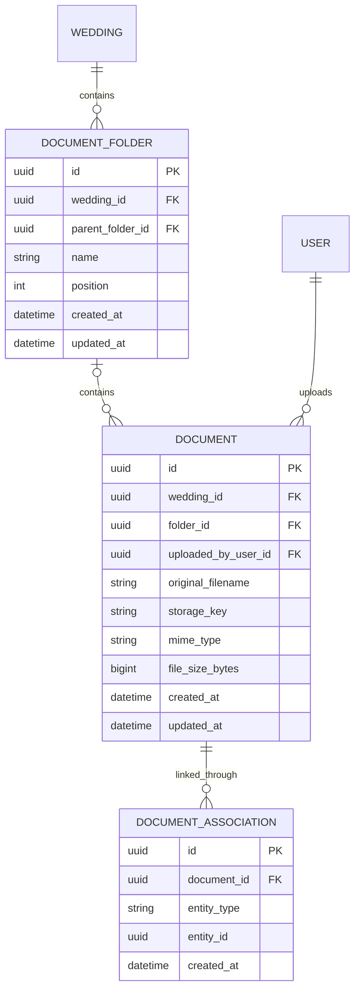

A document may be associated with entities such as:

- Task
- Supplier
- Venue
- Expense
- Note
- Guest

The implementation must validate that the associated entity belongs to the same wedding as the document.

---

## Notes and Tags

Notes belong to a wedding and may be organised, pinned and tagged.

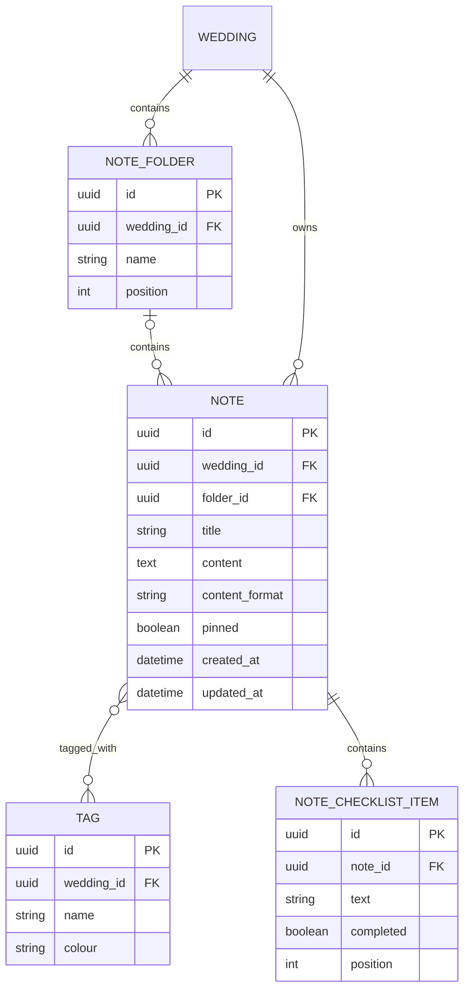

The initial note format may be Markdown. Rich-text JSON may be introduced later if required.

---

## Notifications and User Preferences

Notifications are user-specific, while most wedding data is shared.

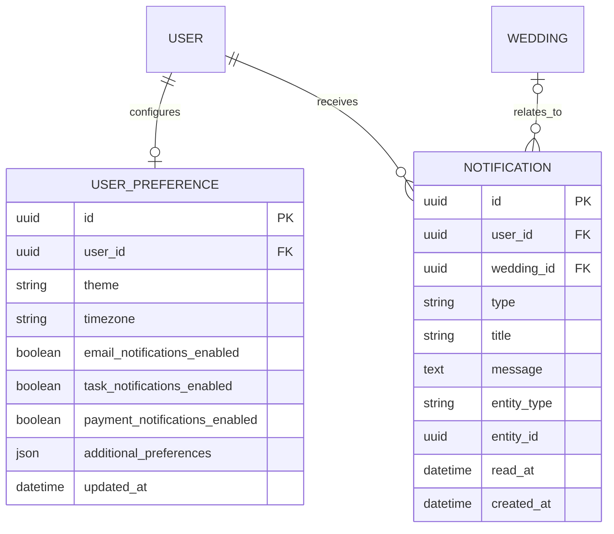

---

## Activity Log

Significant actions are recorded for visibility and auditing.

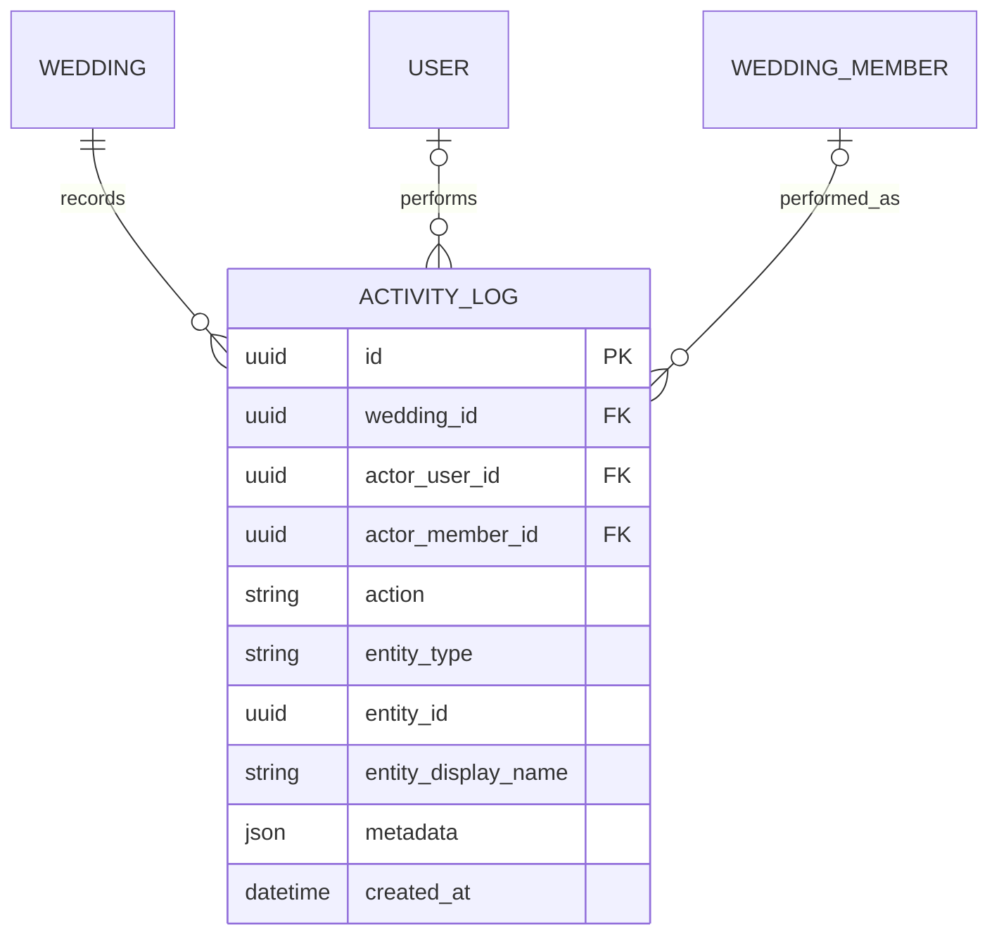

### Activity rules

- Activity records are append-only.
- Historical activity remains when a user leaves a wedding.
- Activity records should not depend on an active membership remaining.
- Important tracked actions include:
  - Task created or completed
  - Guest added or updated
  - RSVP manually changed
  - Invitation sent
  - Supplier updated
  - Payment recorded
  - Timeline edited
  - Seating assignment changed
  - Document uploaded
  - Wedding member added or removed

---

## Derived Dashboard Data

The dashboard does not require a dedicated database table.

The following values are calculated from underlying records:

- Days until the wedding
- Planning completion percentage
- Upcoming tasks
- Overdue tasks
- Total invited guests
- Accepted, declined and pending RSVPs
- Meal totals
- Dietary requirement summaries
- Total budget
- Total committed spend
- Total paid
- Remaining budget
- Upcoming and overdue payments
- Supplier status totals
- Seating completion
- Registry completion
- Recent activity

Derived data must not be duplicated in persistent tables unless a later performance requirement justifies caching it.

---

## Cross-Wedding Data Isolation

Every wedding-owned entity must include a direct or safely traceable relationship to a wedding.

The application must verify that:

- users can only access weddings where they hold an active membership;
- foreign-key relationships never connect records from different weddings;
- assigned members belong to the relevant wedding;
- guests, suppliers, expenses, documents and categories belong to the same wedding when linked;
- all API operations apply wedding-scoped authorisation.

---

## Deletion Behaviour

The detailed deletion rules will be finalised in the Prisma schema, but the logical behaviour is:

- Deleting a wedding removes its associated planning data after explicit confirmation.
- The final wedding owner cannot leave or be removed.
- User activity history remains after membership removal.
- Task categories containing tasks require a move, delete or cancel decision.
- Supplier categories containing suppliers follow the same protected deletion approach.
- Budget categories containing expenses cannot be silently deleted.
- Deleting a household does not automatically delete its guests.
- Deleting a table requires its guests to be unassigned or moved.
- Deleting a folder should require its contents to be moved or explicitly deleted.
- Activity records are retained unless the entire wedding is permanently deleted.

---

## Implementation Notes

When this model is translated into Prisma:

- Use UUID primary keys.
- Add `created_at` and `updated_at` fields to mutable entities.
- Add compound unique constraints where required.
- Add indexes to commonly filtered foreign keys and status fields.
- Use explicit join models when relationships require metadata.
- Define relation deletion behaviour deliberately rather than relying on defaults.
- Store money as integer minor units.
- Store uploaded files in object storage rather than PostgreSQL.
- Validate wedding ownership at both the service and database-access layers.
